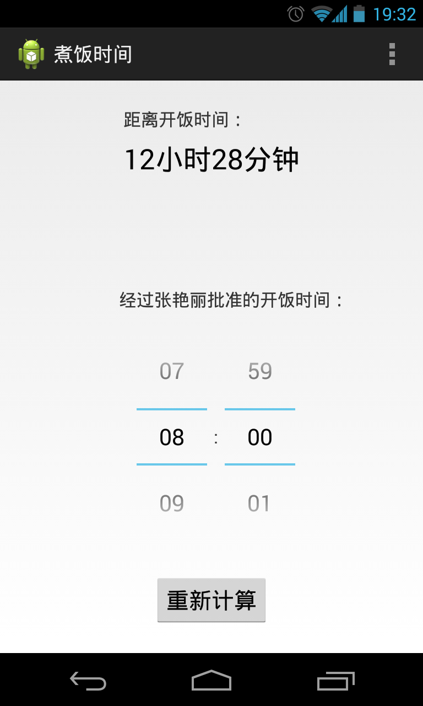

cooktime
========

一个很简单的计算煮饭时间的Android手机软件。下载地址：[CookTime.apk](https://github.com/liigo/cooktime/raw/master/bin/CookTime.apk) (270KB)

其主要功能是：

- 计算并显示当前时间与开饭时间的时间间隔

- 软件启动后、修改开饭时间后自动计算

- 显示部分放在屏幕上方、操作部分放在屏幕下方，方便使用

- 自动记忆修改后的开饭时间

软件主界面如下：

